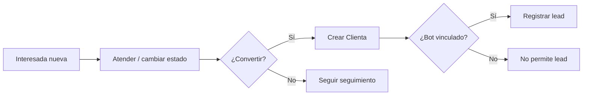

# Funcional del CRM

## 1) Propósito funcional

El CRM centraliza operación comercial y seguimiento de varias ramas:

- **LaMami** (interesadas, clientas, leads, bots, LamamiBot)
- **Jostal** (interesadas, clientas, leads, ventas)
- **Casawasap** (contactos/clientes y pagos)
- **Comercial** (captación conversacional por líneas)
- **Publicista** (cuentas, jobs, campañas, tareas, runs)
- **Avisos** (motor transversal de alertas)

## 2) Módulos visibles en menú principal

Según `render_sidebar()` en `app/views.php`:

- Dashboard
- Jostal
- LaMami
- Casawasap
- Gastos
- Informes
- AvisosWasap
- Josué
- Bots
- Publicista
- Comercial

## 3) Flujo funcional principal (LaMami)

Reglas base heredadas de `README.txt`:

- Flujo esperado: **Interesada → Atendida → Convertida → Clienta**.
- No se crean clientas “desde cero”: la conversión parte de interesada.
- Los leads se registran sobre la ficha de clienta.
- Solo se registran leads si la clienta tiene bot vinculado.

## 4) Flujos funcionales por rama

### 4.1 LaMami
- Gestión de interesadas (`interesadas.json`).
- Conversión a clientas (`clientes.json`).
- Gestión de bots (`bots.json`) y LamamiBot (`lamamibot.json`).
- Registro de leads (`leads.json`).

### 4.2 Jostal
- Interesadas y conversión a clientas (`jostal_interesadas.json`, `jostal_clientas.json`).
- Registro de leads y ventas (`jostal_leads.json`, `jostal_ventas.json`).
- Subvistas (interesadas/clientas/ventas/informes) en `page=jostal&tab=...`.

### 4.3 Casawasap
- Gestión de contactos/clientes (`casawasap_contactos.json`).
- Registro de pagos (`casawasap_pagos.json`).
- Estados de cliente activos/baja y eventos para avisos.

### 4.4 Comercial
- Captación y seguimiento por líneas telefónicas.
- Gestión de procesos, hilos y leads comerciales.
- Recepción de eventos entrantes vía webhook.

### 4.5 Publicista
- Gestión de cuentas de anuncio, jobs, campañas y ejecución.
- Módulo intensivo en datos y automatizaciones.

### 4.6 Avisos
- Motor de avisos activos/descartados/planificados.
- Alimentado por múltiples módulos (ingresos, leads, cobros, integridad, etc.).

## 5) Reglas funcionales actualmente documentadas

De `README.txt` y configuración actual:

- Avisos de hitos (ingresos/beneficio), inactividad, conversión pendiente, retrasos y calidad de datos.
- Recordatorios operativos recurrentes para publicaciones (Destacamos/MundoSex) configurables.
- Avisos manuales planificados para fecha/hora futura (integrados en el mismo sistema de descarte).

> Nota: la lista completa de tipos de aviso y umbrales está en `README.txt` y `avisos_config.php`.

## 6) Dashboard e Informes

- Dashboard consolida métricas operativas de varias ramas.
- Informes y grid mensual presentan visión agregada de ingresos/gastos y actividad.

## 7) Actores y uso esperado

- **Operación diaria**: seguimiento de interesadas, clientas, pagos, leads, avisos.
- **Coordinación comercial**: uso de Comercial y control de líneas.
- **Publicidad**: planificación y ejecución en Publicista.

## 8) Límites de esta documentación funcional

- No se fuerza modelo “ideal”; se describe la operativa tal como está en código y fuentes locales.
- Hay lógica detallada de algunas reglas en funciones internas sin especificación externa formal.
