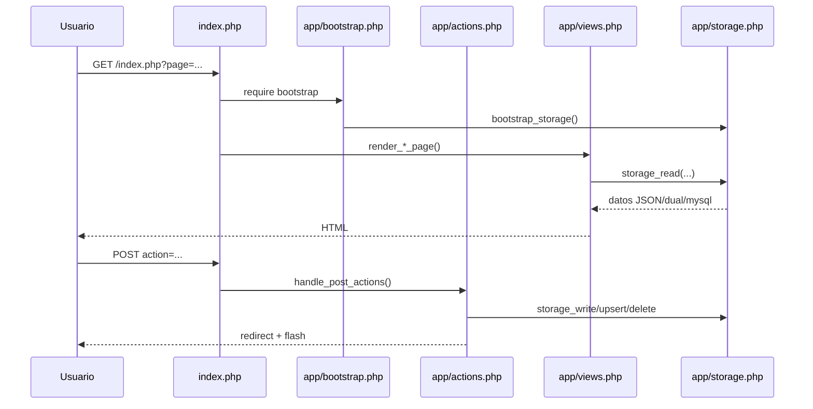
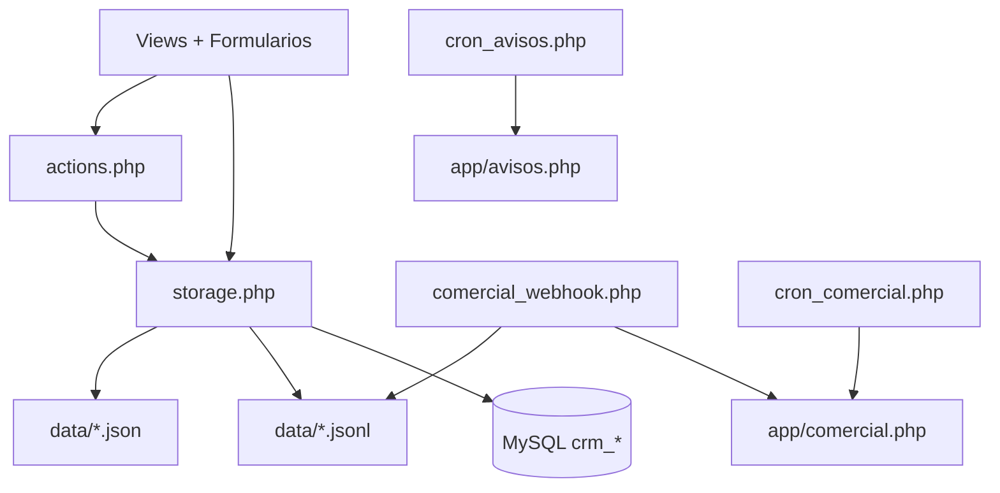

# Técnico · Arquitectura

## 1) Vista general

Arquitectura PHP monolítica con:

- Entrada web principal: `index.php`
- Bootstrap global: `app/bootstrap.php`
- Renderizado server-side: `app/views.php`
- Despacho de acciones POST: `app/actions.php`
- Persistencia principal en JSON/JSONL en `data/`
- Soporte de backend `json | dual | mysql` en `app/storage.php`

## 2) Bootstrap

`app/bootstrap.php`:

1. Define constantes:
   - `BASE_PATH`
   - `APP_PATH`
   - `DATA_PATH`
2. Prepara runtime:
   - zona horaria `Europe/Madrid`
   - logging de errores a `data/php_errors.log`
   - fallback de sesiones en `data/sessions` si aplica
3. Carga módulos PHP por `require_once`.
4. Ejecuta `bootstrap_storage()` para inicializar ficheros base.

## 3) Routing HTTP de aplicación

`index.php` controla:

- `GET page` para selección de pantalla.
- Redirección de login/logout.
- Auto-login por whitelist de IP (`auth_auto_login_from_whitelist`).
- En `POST`, ejecuta `handle_post_actions()`.

### Mapeo principal de páginas

- `dashboard` (por defecto)
- `lamami`, `interesadas`, `clientas`, `lamamibot`
- `publicista`
- `comercial`
- `bots`
- `informes` / `gridmensual`
- `josue`
- `casawasap`
- `jostal`
- `gastos`
- `avisos`

## 4) Flujo request/response

## 5) Capa de persistencia

### 5.1 Estado actual operativo

- Fuente principal activa: `data/`.
- `storage_read/write/upsert/delete` abstrae acceso.
- Escrituras JSON suelen ser de fichero completo (impacto en volumen alto).

### 5.2 Modos de backend soportados

- `json` (por defecto)
- `dual`
- `mysql`

Definición por `CRM_STORAGE_BACKEND` o `settings.json`.

### 5.3 Integración MySQL existente

Según `docs/mysql_migration_phase1.md` y `docs/mysql_phase2_setup.md`:

- Hay esquema `crm_*` preparado en `sql/mysql_phase1_schema.sql`.
- `app/db.php` centraliza conexión PDO (DB por defecto: `telefonosbd`).
- Convive con runtime JSON y transición gradual.

## 6) Endpoints operativos auxiliares

- `cron_avisos.php` → ejecuta motor de avisos.
- `cron_comercial.php` → ejecuta tick comercial y devuelve JSON.
- `comercial_webhook.php` → recibe webhook comercial, loguea JSONL y delega en `comercial_handle_webhook_http()`.
- `comercial_thread_feed.php` → feed JSON de hilo comercial con control de sesión.

## 7) Mapa de módulos/datos (alto nivel)

## 8) Observaciones técnicas relevantes

- Existe duplicado de algunos case en `handle_post_actions()` (mantenimiento).
- `comercial_webhook.php` escribe log directo a JSONL fuera del wrapper general de storage.
- En modo JSON, errores de parse pueden degradar lectura a arrays vacíos en determinados escenarios (documentado en migración MySQL Fase 1).
